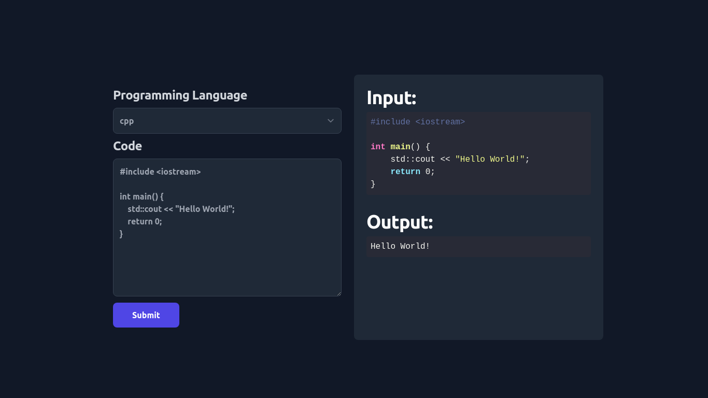

<h1 align="center">Compiler</h1>
This is an online executor which is built around the <a href="https://github.com/engineer-man/piston" target="_blank">Piston API</a>. <a href="" target="_blank">Live Demo</a>

</img>

## Getting Started

1. Clone the repository:

```bash
git clone https://github.com/edw-in/Compiler
```

2. Install the dependancies

```bash
npm install
# or
yarn install
```

3. Run the development server

```bash
npm run dev
# or
yarn dev
```

Open [http://localhost:3000](http://localhost:3000) with your browser to see the result.

# Supported Languages

`awk`,
`bash`,
`brainfuck`,
`c`,
`cpp`,
`clojure`,
`crystal`,
`csharp`,
`d`,
`dash`,
`deno`,
`elixir`,
`emacs`,
`elisp`,
`go`,
`haskell`,
`java`,
`jelly`,
`julia`,
`kotlin`,
`lisp`,
`lolcode`,
`lua`,
`nasm`,
`nasm64`,
`nim`,
`node`,
`osabie`,
`paradoc`,
`perl`,
`php`,
`python2`,
`python3`,
`ruby`,
`rust`,
`scala`,
`swift`,
`typescript`,
`zig`,

<br>

# Future Updates

- [ ] Integrate <a href="https://github.com/codemirror/codemirror" target="_blank">CodeMirror</a>
      <br>
- [ ] More themes
